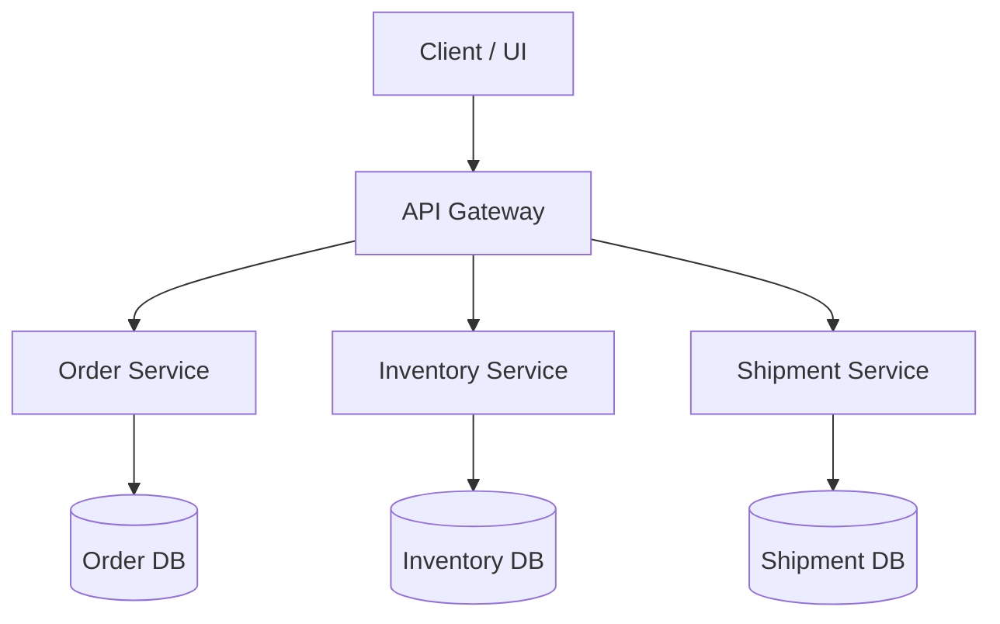
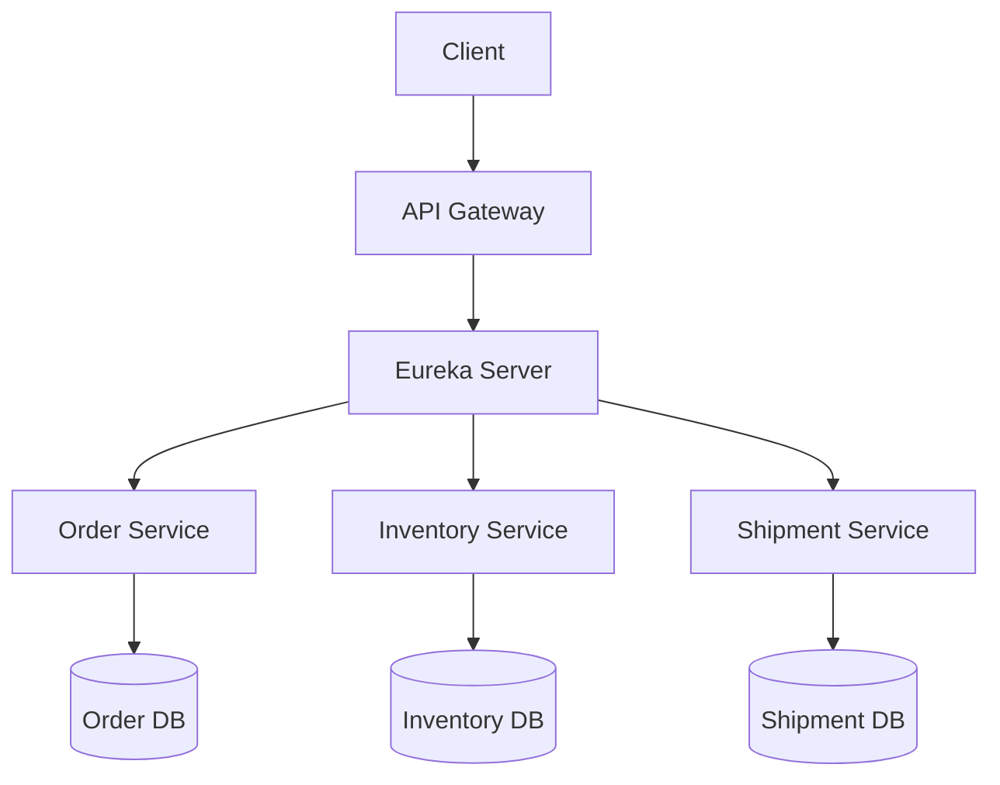

# API Gateway

## With Out Eureka Service

### Characterstics
- You define fixed URLs for services inside the API Gateway (like localhost:8081, localhost:8082).

- Each service is started manually on a specific port.

- The gateway knows where to send requests because the URLs are hardcoded.

## With Eureka Service

