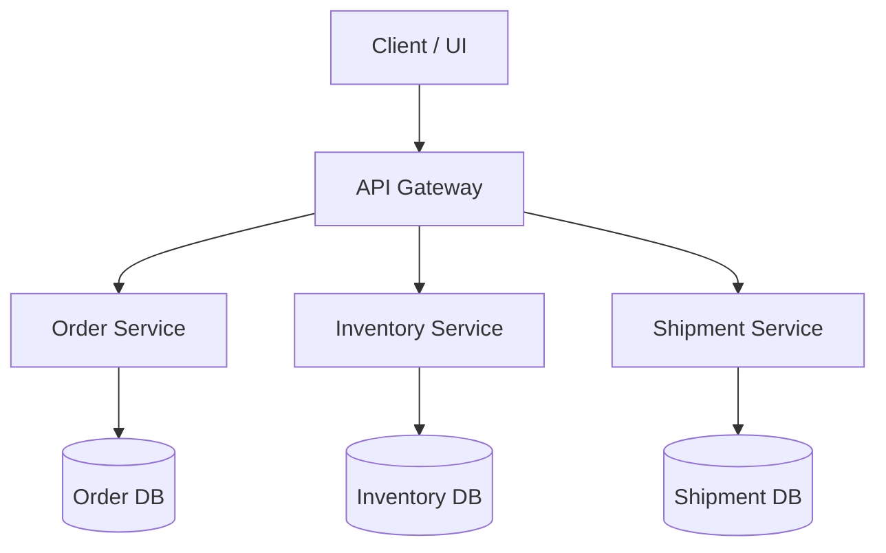
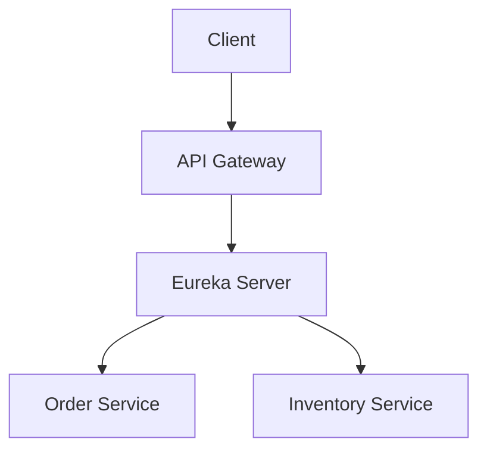

# API Gateway

## With Out Eureka Service

```mermaid
flowchart TD
    A[Client / UI]
    B[API Gateway]
    C[Order Service]
    D[Inventory Service]
    E[Shipment Service]
    F[(Order DB)]
    G[(Inventory DB)]
    H[(Shipment DB)]

    A --> B
    B --> C
    B --> D
    B --> E
    C --> F
    D --> G
    E --> H
```

## With Eureka Service

```mermaid
flowchart TD
    A[Client] --> B[API Gateway]
    B --> C[Eureka Server]
    C --> D[Order Service]
    C --> E[Inventory Service]
```

