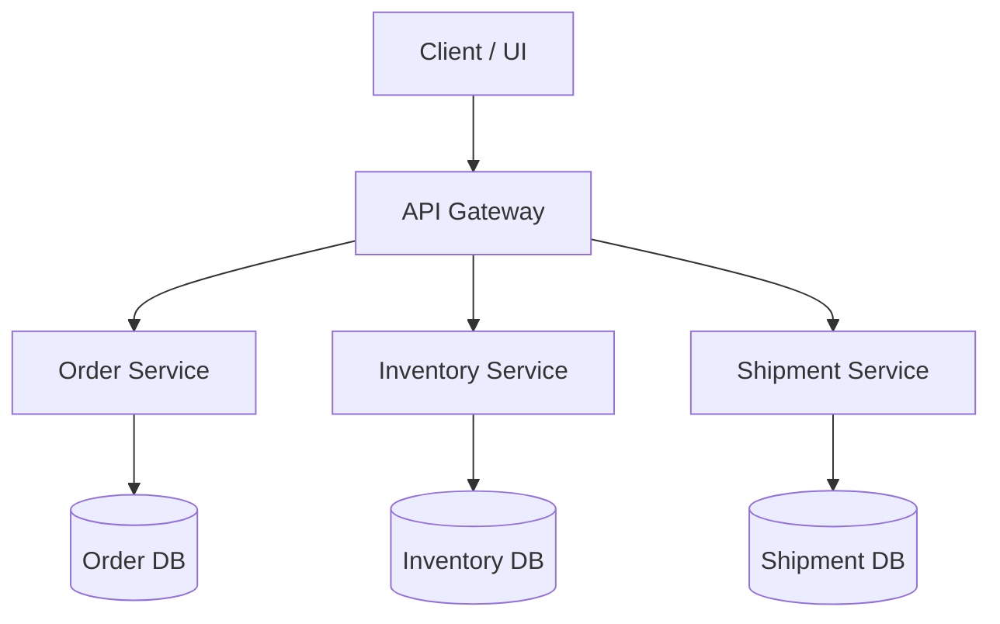
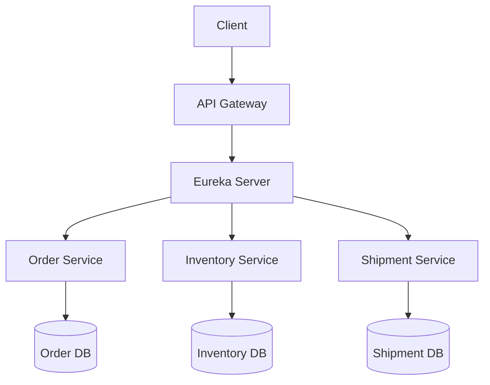

# API Gateway

## With Out Eureka Service

### Characterstics
- You define fixed URLs for services inside the API Gateway (like localhost:8081, localhost:8082).

- Each service is started manually on a specific port.

- The gateway knows where to send requests because the URLs are hardcoded.

| Feature                  | Without Eureka                                                    |
| ------------------------ | ----------------------------------------------------------------- |
| **Service registration** | Manual — you configure URLs in `application.yml`                  |
| **Discovery**            | Static — Gateway uses hardcoded routes                            |
| **Scaling**              | Difficult — adding new service instances requires updating config |
| **Fault tolerance**      | Limited — Gateway can’t detect if a service goes down             |
| **Dev simplicity**       | ✅ Easy for small setups                                           |
| **Cloud readiness**      | ❌ Not ideal for dynamic or containerized environments             |

## With Eureka Service

🧠 Characteristics
| Feature                  | With Eureka                                                   |
| ------------------------ | ------------------------------------------------------------- |
| **Service registration** | ✅ Automatic (services register on startup)                    |
| **Discovery**            | ✅ Dynamic — Gateway looks up service names from Eureka        |
| **Scaling**              | ✅ Easy — Add new instances, Eureka auto-discovers them        |
| **Fault tolerance**      | ✅ Gateway avoids dead services automatically                  |
| **Dev complexity**       | ⚙️ Slightly more setup (needs Eureka Server)                  |
| **Cloud readiness**      | ✅ Perfect for containerized environments (Docker, Kubernetes) |

